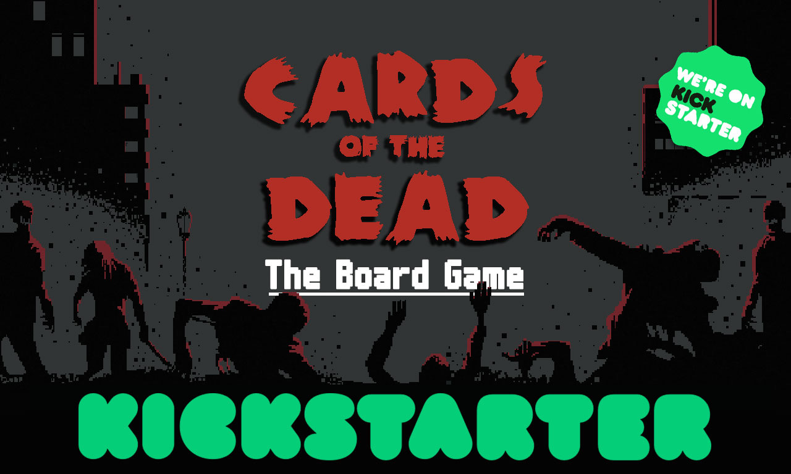

<div id="top"></div>

[![Contributors][contributors-shield]][contributors-url]
[![Forks][forks-shield]][forks-url]
[![Stargazers][stars-shield]][stars-url]
[![Issues][issues-shield]][issues-url]
[![MIT License][license-shield]][license-url]


<!-- PROJECT LOGO -->
<br />
<div align="center">
  <a href="https://www.kickstarter.com/projects/jandusoft/cards-of-the-dead-the-board-game">
    
  </a>

  <h3 align="center">Cards of the Dead - The Board Game</h3>

  <p align="center">
    Rulebook Manuals for Cards of the Dead - The Board Game
    <br />
    <a href="https://www.kickstarter.com/projects/jandusoft/cards-of-the-dead-the-board-game"><strong>View our Campaign »</strong></a>
    <br />
    <br />
    <a href="https://www.kickstarter.com/projects/jandusoft/cards-of-the-dead-the-board-game">View Game</a>
    ·
    <a href="https://github.com/JanduSoft/CardsOfTheDead_Manuals/issues">Report Bug</a>
    ·
    <a href="https://github.com/JanduSoft/CardsOfTheDead_Manuals/issues">Request Feature</a>
  </p>
</div>


<!-- TABLE OF CONTENTS -->
<details>
  <summary>Table of Contents</summary>
  <ol>
    <li>
      <a href="#about-the-project">About The Project</a>
      <ul>
        <li><a href="#built-with">Built With</a></li>
      </ul>
    </li>
    <li>
      <a href="#getting-started">Getting Started</a>
      <ul>
        <li><a href="#prerequisites">Prerequisites</a></li>
      </ul>
    </li>
    <li><a href="#contributing">Contributing</a></li>
    <li><a href="#license">License</a></li>
    <li><a href="#contact">Contact</a></li>
    <li><a href="#acknowledgments">Acknowledgments</a></li>
  </ol>
</details>


<!-- ABOUT THE PROJECT -->
## About The Project

[![Cards of the Dead][product-screenshot]](https://www.kickstarter.com/projects/jandusoft/cards-of-the-dead-the-board-game)

  ```sh
Cards of the Dead: The Board Game is an adaptation of the Cards of the Dead video game.
A survival game for 1-3 players in a city infested by Zombies.

The game offers an experience that differs from the video game, and can be played  solo or with multiple players.


In Cards of the Dead: The Board Game players must take control of one of the Survivors and make it out of the city alive over the course of three days.
Players are advised to explore the interiors of places like the Supermarket where they will need to stock up with equipment and resources in order to remain alive throughout the game.
At the same time, they will need to contain the Zombies who infest the city and its vicinity, before being surrounded and falling prey to their incessant hunger…
  ```

On this repository you can find the instructions to create a localization version of the game manual.

<p align="right">(<a href="#top">back to top</a>)</p>


### Built With

This manual has been made with Scribus, an Open Source Desktop Publishing tool available on all platforms. And a free font by Daniel Linssen.

* [Scribus](https://https://www.scribus.net/)
* [m6x11 Font](https://managore.itch.io/m6x11/)

<p align="right">(<a href="#top">back to top</a>)</p>


<!-- GETTING STARTED -->
## Getting Started

In this section you will learn the steps to localize the game manual to another language.

### Prerequisites

1. Install the font <a href="https://managore.itch.io/m6x11/">m6x11 Font</a>
2. Install <a href="https://www.scribus.net/downloads/">Scribus</a>


<p align="right">(<a href="#top">back to top</a>)</p>


<!-- CONTRIBUTING -->
## Contributing

Contributions are what make the open source community such an amazing place to learn, inspire, and create. Any contributions you make are **greatly appreciated**.

If you have a suggestion that would make this better, please fork the repo and create a pull request. You can also simply open an issue with the tag "enhancement".
Don't forget to give the project a star! Thanks again!

1. Fork the Project
2. Create your Feature Branch (`git checkout -b feature/AmazingFeature`)
3. Commit your Changes (`git commit -m 'Add some AmazingFeature'`)
4. Push to the Branch (`git push origin feature/AmazingFeature`)
5. Open a Pull Request


In order to create a new Localized version of the Manual, we recommend to duplicate the file <b>EN_CardsOfTheDead.sla</b> to a <b>ISOCODE_CardsOfTheDead.sla</b> and edit the new file

<p align="right">(<a href="#top">back to top</a>)</p>


<!-- LICENSE -->
## License

Distributed under the MIT License. See `LICENSE.txt` for more information.

<p align="right">(<a href="#top">back to top</a>)</p>


<!-- CONTACT -->
## Contact

JanduSoft S.L. - [@JanduSoft](https://twitter.com/JanduSoft)

Project Link: [https://github.com/JanduSoft/CardsOfTheDead_Manuals](https://github.com/JanduSoft/CardsOfTheDead_Manuals)

<p align="right">(<a href="#top">back to top</a>)</p>


<!-- ACKNOWLEDGMENTS -->
## Acknowledgments

Here is a list of useful projects used for making this manual

* [Best-Readme-Template](https://github.com/othneildrew/Best-README-Template)
* [Choose an Open Source License](https://choosealicense.com)
* [GitHub Emoji Cheat Sheet](https://www.webpagefx.com/tools/emoji-cheat-sheet)
* [Malven's Flexbox Cheatsheet](https://flexbox.malven.co/)
* [Malven's Grid Cheatsheet](https://grid.malven.co/)
* [Img Shields](https://shields.io)
* [GitHub Pages](https://pages.github.com)
* [Font Awesome](https://fontawesome.com)
* [React Icons](https://react-icons.github.io/react-icons/search)

<p align="right">(<a href="#top">back to top</a>)</p>


<!-- MARKDOWN LINKS & IMAGES -->
<!-- https://www.markdownguide.org/basic-syntax/#reference-style-links -->
[contributors-shield]: https://img.shields.io/github/contributors/othneildrew/Best-README-Template.svg?style=for-the-badge
[contributors-url]: https://github.com/JanduSoft/CardsOfTheDead_Manuals/graphs/contributors
[forks-shield]: https://img.shields.io/github/forks/othneildrew/Best-README-Template.svg?style=for-the-badge
[forks-url]: https://github.com/JanduSoft/CardsOfTheDead_Manuals/network/members
[stars-shield]: https://img.shields.io/github/stars/othneildrew/Best-README-Template.svg?style=for-the-badge
[stars-url]: https://github.com/JanduSoft/CardsOfTheDead_Manuals/stargazers
[issues-shield]: https://img.shields.io/github/issues/othneildrew/Best-README-Template.svg?style=for-the-badge
[issues-url]: https://github.com/JanduSoft/CardsOfTheDead_Manuals/issues
[license-shield]: https://img.shields.io/github/license/othneildrew/Best-README-Template.svg?style=for-the-badge
[license-url]: https://github.com/JanduSoft/CardsOfTheDead_Manuals/blob/master/LICENSE.txt
[product-screenshot]: images/screenshot.jpg